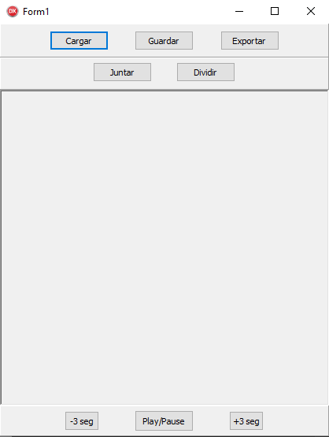

# *Herramientas Transcripcion+Revision de entrevistas*

**Escuela de Informática, Universidad Nacional del Oeste**  

**Titulo:** Atender aspectos lingüístico-cognitivos en la captura de términos del contexto.

**Integrantes:** 
- Graciela D.S. Hadad
- Jorge H. Doorn
- María C. Elizalde
- Ignacio A. García Ravlic
- Damián Casafuz

**Objetivo:** Se busca minimizar el tiempo de transcripcion sin perder calidad, creando herramientas e incorporando otras preexistentes.

---
## ***Flujo de trabajo***

1. Obtener una **Grabacion** con el menor ruido de fondo posible.
2. Convertir la **Grabacion** a formato mp3 si no lo esta.
3. **Transcribir** la **Grabacion** utilizando VOSK o IBM.
4. **Normalizar** la **Transcripcion**.
5. Revisar la **Transcripcion** comparando con la **Grabacion**.
6. Guardar la **Revision**.


## ***Paso a Paso***
A continuacion se explicara como utilizar las herramientas a partir de una grabacion en formato mp3.


### ***1- Transcribir la Grabacion***
Para esta etapa tendremos 2 opciones, se recomienda utilizar VOSK por su facilidad de uso y por la pequeña diferencia en la calidad.

- ***VOSK***

Para utilizarlo se debe ir a la carpeta donde esta el *voskTransciptor.py*, abrir la consola y ejecutar:

```
voskTransciptor.exe {Grabacion}
```

donde grabacion es la direccion relativa o exacta de donde esta la **Grabacion** a **transcribir**, incluyendo la extencion(.mp3).

Como resultado se obtiene la **Transcripcion** *data.json*.

EJ: 
```
voskTransciptor.exe audio.mp3
```

- ***IBM***

Antes de utilizar la herramienta se debe crear una cuenta y crear un servicio en IBM siguiendo estos pasos:

1. Ir a [esta pagina de IBM](https://cloud.ibm.com/) y registrarse, los pasos son pocos y simples, no se requiere de metodo de pago.
2. Ir a [este enlace](https://cloud.ibm.com/catalog/services/speech-to-text) para crear un servicio, es opcional cambiarle el nombre.
3. Una vez creado el servicio les abrira un panel, dirigirse a la opcion **Gestionar** y alli pueden copiar su Clave y URL.

Para utilizarlo se debe ir a la carpeta donde esta el *ibmTransciptor.py*, abrir la consola y ejecutar:

```
ibmTranscriptor.exe {Grabacion} {Clave} {URL}
```

donde *grabacion* es la direccion relativa o exacta de donde esta la **Grabacion** a **transcribir**, incluyendo la extencion(.mp3);  
donde *transcripcion* es la direccion relativa o exacta donse se guardara el resultado, si se quiere guardar en la misma carpeta unicamente indicar nombre y extension del archivo;  
donde *clave* es la clave que les otorgo IBM;  
y donde *url* es el enlace al servicio creado en IBM.

Como resultado se obtiene la **Transcripcion**.

EJ: 
```
ibmTranscriptor.exe audio.mp3 \
aab57cddee-ff22hhii-j12rs-aabb22ddee33gghhj \
https://api.us-south.speech-to-text.watson.cloud.ibm.com/instances/12345678-12aa-12bb-12cc-123456789aab
```


### ***2- Normalizar la Transcripcion***
Para utilizarlo se debe ir a la carpeta donde esta el *normalizador.py*, abrir la consola y ejecutar:
    
```
normalizador.exe -i {Transcripcion} [-o {Normalizada}] [-d {Separador de Parrafo}] [--ibm]
```

donde *transcripcion* es la direccion relativa o exacta de el resultado del paso anterior(**Transcripcion**), con su extension;  
donde *normalizada* es la direccion relativa o exacta donde se guardara el resultado, de no especificar se guardara junto al ejecutable llamandose *clean.json*;  
donde *separador de parrafo* es la diferencia en segundos que debe haber entre 2 palabras para ser consideradas de diferente parrafo, de no especificar se utilizara el valor *0.8*;  
y donde *--ibm* indicara si es una transcripcion de **IBM**, de no especificar se tomara como si fuera una transcripcion de **VOSK**.


### ***3- Revisar la Transcripcion***
La ultima etapa de este flujo de trabajo consiste en revisar la calidad de la transcripcion, para esto esta el **Revisor.exe**, a continuacion se explicara su propio flujo de trabajo y funcionalidades extras. 

1. Una vez abierto el revisor veran la siguiente interfaz.  


2. El primer paso es darle a **Cargar**, se les abrira una ventana de busqueda y primero agregaran:
    - La **Transcripcion Normalizada**
    - La **Grabacion** en formato mp3

3. Una vez cargado el input se puede comenzar la revision, para eso se tienen las siguientes funcionalidades:
    
    1. Seleccionar un parrafo y hacer edicion de texto(insertar, eliminar y cambiar)
    2. Reproducir y Pausar el audio al darle al boton **Play/Pause**.
    3. **Avanzar y Retroceder** de a 3 segundos en el audio.
    4. Guardar la **Revision** en proceso al darle al boton **Guardar**.
    5. Exportar el texto plano de transcripcion al darle al boton **Exportar**.
    6. Si el audio esta reproduciendose, al seleccionar un parrafo se empezara a repoducir a partir de este parrafo seleccionado.
    7. Agregar al final del parrafo el contenido del parrafo siguiente al darle al boton **Juntar**, para esto se debio haber seleccionado un parrafo previamente(con un simple click).  
    
    8. Crear un parrafo abajo, moviendo todo el contenido desde el cursor hasta el final hacia el nuevo parrafo, se debe haber seleccionado la posicion especifica y luego darle al boton **Dividir**.  
    
    9. Una vez cargada una revision, se puede volver a cargar otra dandole nuevamente al boton **Cargar**, advertencia: los cambios no guardados de la revision anterior se perderan
